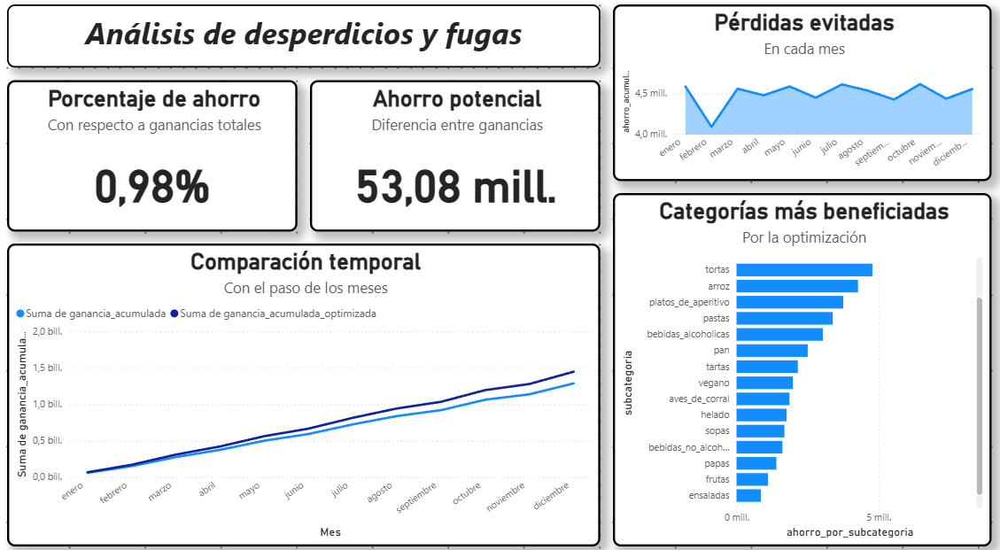

# Análisis de Desperdicios

En este repositorio realizo un análisis e investigación con respecto al impacto que podría tener la optimización de fugas y desperdicios dentro de los restaurantes y sectores gastronómicos, centrándome en precios de **mayoristas argentinos**.

---

## Contexto del Proyecto

Este análisis surge de una necesidad real: evaluar la viabilidad económica de implementar un sistema propio diseñado para reducir fugas y desperdicios en restaurantes.
La intención original era validar si dicha herramienta podía ofrecer un beneficio lo suficientemente significativo como para comercializarla a un cliente del sector gastronómico.

El proyecto, por lo tanto, no utiliza datos simulados por conveniencia, sino que responde a una pregunta de negocio concreta:
**¿Conviene invertir en un sistema de control de desperdicios en el contexto económico argentino actual?**

---

## Objetivo:

Analizar el rendimiento del restaurante, fugas probables, costos y colaborar en la decisión de implementar un sistema que permita un mejor control de la materia prima empleada.

Incluye:
- Identificación de pérdidas 
- Impacto económico
- Proyección de ahorro tras la optimización
- KPIs y métricas de negocio
- Decisión final y conclusión de implementación sistemática
- Dashboard final

---

## Estructura del proyecto
```
analisis-gastronomico/
|-- data/ # datos crudos, limpios y staging
|-- scripts/ # scripts reutilizables y procesos aislados
|-- notebooks/ # notebooks de EDA, wrangling, conversión y análisis
|-- equivalencias/ # diccionarios y mapeos usados para unificar categorías
|-- reporte-analítico.png # dashboard y reporte final
|-- requirements.txt # dependencias del proyecto
|-- README.md # este archivo
```

---

## Tecnologías utilizadas

- **Python** (Jupyter Notebooks)  
- **Pandas** -> limpieza, feature engineering y transformación  
- **Matplotlib** -> visualizaciones base  
- **Power BI** -> dashboard de análisis  

---

## Proceso General

### 1. Exploración inicial y búsqueda de datasets
El proyecto utiliza una combinación de **datasets simulados** y **precios reales** obtenidos de mayoristas y reportes del INDEC.

#### `Restaurant_Data.xlsx`
Dataset base con ventas y recetas del restaurante ficticio.

### Otras fuentes consultadas
- Informe de precios del **INDEC**  
- Reportes del sector gastronómico  
- Fuentes complementarias para precios internacionales 
- APIs para consulta de cotizaciones 

> Para más información revisar: `data/README.md`

---

### 2. Data Wrangling 

Tareas realizadas en esta etapa:
- Eliminación de nulos  
- Estandarización a `snake_case`  
- Unificación de unidades (g -> kg)  
- Conversión de moneda cuando corresponde  
- Limpieza general del dataset para mantener la consistencia en las notebooks 

> La traducción de columnas se mantuvo aislada para optimizar performance. Detalles en `scripts/README.md`.

---

### 3. Equivalencias y paso a mercado argentino

El dataset del restaurante posee categorías propias, mientras que el INDEC maneja un esquema completamente distinto.  
Para permitir análisis conjuntos, se generaron:

- Diccionarios de mapeo entre categorías  
- Equivalencias entre subcategorías  
- Unificación de criterios de clasificación  

> Para más información revisar: `equivalencias/README.md`

---

### 4. Análisis final

Esta sección incluye la creación de KPIs, elaboración del reporte final en Power BI, conclusiones finales y análisis gráfico.

## Instrucciones de uso

### 1. Instalar dependencias

```bash
pip install -r requirements.txt
```

### 2. Abrir los notebooks

Los notebooks dentro de `/notebooks`, los cuales tienen el orden de ejecución de:

```
eda.ipinb -> data_wrangling.ipynb -> paso_mercado.ipynb -> analisis_final.ipynb
```

> **Importante:** Luego de ejecutar el primer notebook (EDA), si no se desea utilizar el archivo `items_traducido.csv` generado previamente y se prefiere crear uno nuevo ejecutando `traducir_df.py`, es necesario tener especial cuidado con posibles errores de traducción.  
> Esto puede ocurrir por limitaciones del traductor automático.

---

## Resultados principales
- Ahorro porcentual máximo estimado: **0.97%** sobre ganancia mensual
- Ahorro monetario (en un año): **$53.08M** de **$4.37B** (en ARS)

> Los valores que obtuve puede que no sean los mismos que usted obtenga, ya que puede ser alterado por el dataset original, traducción o cotización del dólar

---

## Conclusión Final del Proyecto

El análisis integral de desperdicios, precios mayoristas y estructura de costos demuestra que la optimización de fugas de stock en restaurantes argentinos tiene un impacto económico marginal.
Incluso aplicando un escenario conservador de control total de desperdicios, la mejora potencial en la rentabilidad es inferior al 1% de la ganancia total.

Este incremento resulta insuficiente para justificar la implementación de un sistema de gestión adicional, considerando:
- Costos de licencias y mantenimiento de software
- Capacitación del personal
- Tiempo operativo destinado a registrar insumos y movimientos
- Incremento en complejidad administrativa

Además, el análisis revela que el peso relativo del costo de alimentos en Argentina es muy bajo respecto a la estructura total del negocio. Factores como alquiler, salarios, servicios y cargas sociales representan un porcentaje significativamente más alto del gasto operativo, y por lo tanto ofrecen un potencial de optimización mucho mayor.

---

## Conclusión ejecutiva

Invertir en un sistema orientado exclusivamente a reducir pérdidas de materia prima no es económicamente conveniente para el sector gastronómico argentino bajo las condiciones actuales.
Los esfuerzos de mejora deberían enfocarse en áreas de mayor impacto financiero, como eficiencia operativa, renegociación de costos fijos y optimización del uso del espacio y del personal.

## Dashboard final




